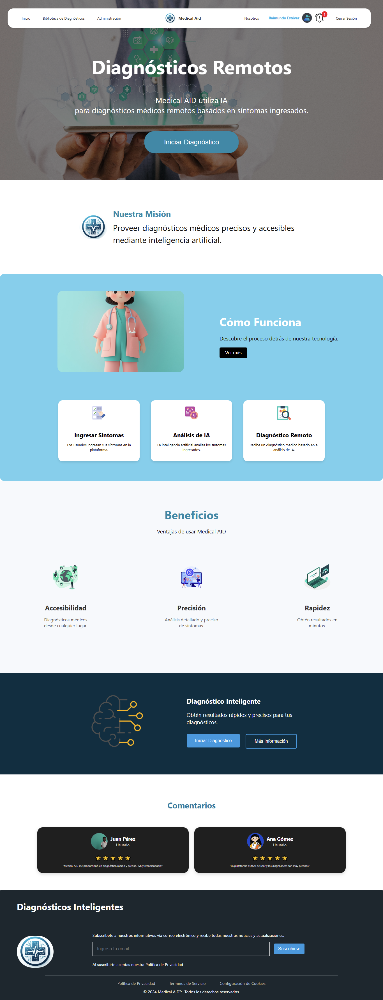
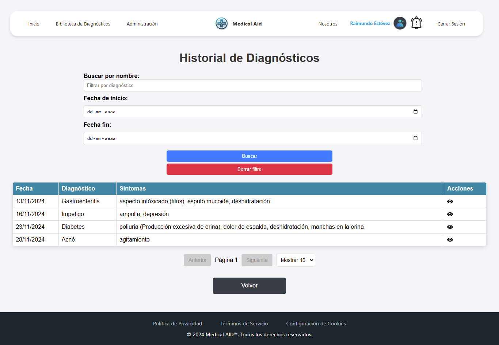

<h1 align="center">Medical AID</h1>

<i>Diagnósticos remotos.</i>

 

Bienvenido al repositorio de **Medical AID**, una aplicación web diseñada para diagnósticos médicos remotos utilizando machine learning desarrollada durante el transcurso de la asignatura "Capstone" de Duoc UC.

## Tabla de contenidos
  - [Aplicación](#Aplicación)
  - [Lenguajes](#Lenguajes)
  - [Tecnología](#Tecnología)
  - [Base de datos](#Base_de_datos)
  - [Arquitectura](#Arquitectura)
  - [Framework](#Framework)
  - [Pasos de implementación](#Pasos_de_implementación)

## Aplicación

Medical AID tiene como objetivo proporcionar un acceso rápido, preciso y económico a diagnósticos médicos remotos. Utiliza machine learning para permitir que los usuarios obtengan diagnósticos confiables.

### Características de la Aplicación

**Manejo de sesiones con JWT**:
  - Las sesiones se gestionan mediante tokens JWT (JSON Web Token), con una duración de 1 hora.
  - Cuando quedan menos de 5 minutos para que expire la sesión, se genera una alerta para que el usuario pueda renovarla.
  - Si el usuario no realiza ninguna acción, la aplicación cierra automáticamente la sesión para garantizar la seguridad.

**Manejo de autorizaciones con roles**:
  - La aplicación cuenta con un sistema de roles que define diferentes niveles de acceso:
    - User: Tiene acceso a todas las funcionalidades generales fuera de la sección de "Administración".
    - Admin: Puede acceder a todas las funcionalidades, incluyendo las de "Administración", exceptuando la gestión de otros administradores.
    - Superadmin: Tiene acceso total, incluyendo la gestión de administradores.
  - Las autorizaciones se validan tanto en el frontend como en el backend para garantizar la seguridad y el cumplimiento de las reglas de acceso.

**Uso de modelo de machine learning**:
La aplicación integra un modelo de machine learning que analiza los síntomas ingresados por el usuario para proporcionar diagnósticos médicos remotos.

**Envío de correos electrónicos**:
  - Se envían correos para confirmar suscripciones al boletín y para recuperar contraseñas olvidadas.

### Vistas de la aplicación

A continuación, se presentan las vistas de la aplicación:

**1. Página de Inicio**
La página principal proporciona una introducción clara a la aplicación y guía a los usuarios hacia las funciones principales.

**2. Sobre Nosotros**
Sección informativa sobre Medical AID.

**3. Biblioteca de Información**
Permite a los usuarios acceder a información detallada sobre enfermedades y recomendaciones.

**4. Formulario de Diagnóstico**
Interfaz para que los usuarios ingresen sus síntomas y soliciten un diagnóstico.

**5. Formulario Intuitivo de Diagnóstico**
Una versión más amigable del formulario, optimizada para facilitar el uso al poder filtrar síntomas por categoría.

**6. Ingresando un Diagnóstico**
Ejemplo del ingreso de síntomas en el formulario intuitivo de diagónstico.

**7. Resultados del Diagnóstico**
Sección que muestra los resultados de un diagnóstico con un resumen claro y recomendaciones específicas.

**8. Iniciar Sesión**
Interfaz para que los usuarios ingresen sus credenciales y accedan a la plataforma.

**9. Registro de Usuarios**
Formulario para que los nuevos usuarios creen una cuenta.

**10. Perfil de Usuario**
Permite a los usuarios ver y actualizar su información personal, como nombre, dirección y más.

**11. Historial de Diagnósticos**
Vista donde los usuarios pueden consultar los diagnósticos realizados previamente.

**12. Actualización de Perfil**
Interfaz para que los usuarios modifiquen sus datos personales.

**13. Cambiar Contraseña**
Formulario para que los usuarios actualicen su contraseña.

**14. Panel de Administración**
Vista exclusiva para administradores, donde pueden gestionar usuarios, diagnósticos y alertas.

**15. Gestión de Usuarios**
Permite a los administradores administrar cuentas de usuario dentro de la plataforma.

**16. Crear Administrador**
Formulario para que un superadmin cree nuevas cuentas de administrador.

**17. Dashboard**
Un dashboard que muestra estadísticas relacionadas con diagnósticos.

**18. Crear Alerta**
Permite a los administradores generar alertas personalizadas para los usuarios.

**19. Barra de Navegación de Alertas**
La barra de navegación muestra notificaciones y alertas relevantes para los usuarios.

**20. Página de Alertas**
Muestra todas las alertas activas o pasadas disponibles para el usuario.

## Lenguajes

El proyecto utiliza los siguientes lenguajes de programación:
- **JavaScript**: Para el desarrollo del frontend, utilizando React.
- **HTML**: Para estructurar el contenido web.
- **CSS/SCSS**: Para el diseño y estilo de la aplicación.
- **Node.js**: Para el desarrollo del backend.
- **SQL**: Para la gestión de la base de datos relacional.
- **Python**: Para el desarrollo del modelo de machine learning y conexión de éste modelo con el backend.

# Tecnología

### Software Utilizado
- **Visual Studio Code**: Editor de código fuente desarrollado por Microsoft. Ofrece una gran variedad de herramientas, soporte y extensiones que permiten el desarrollo de código, incluyendo: soporte para depuración, control de versiones integrado, resaltado de sintaxis, finalización de código inteligente, fragmentos y refactorización de código.
- **PGAdmin**: Herramienta de administración y desarrollo de bases de datos para PostgreSQL.
- **GitHub**: Plataforma de hosting de repositorios de código que permite la colaboración y control de versiones utilizando Git.
- **Google Collab**: Entorno de desarrollo interactivo basado en la nube que permite ejecutar código Python directamente desde un navegador. ütil para el desarrollo y experimentación con modelos de machine learning, análisis de datos y pruebas rápidas de código.
  
### Frontend
- **React**: Librería desarrollada por Facebook para construir interfaces de usuario (UI).
- **React Router DOM**: Librería para manejar el enrutamiento en la aplicación.
- **Axios**: Cliente HTTP para realizar peticiones a la API.
- **React Toastify**: Librería para mostrar notificaciones.
- **SweetAlert2**: Librería para mostrar alertas.
- **FontAwesome**: Librería con Iconos.
- **React Select**: Componente para manejar listas desplegables con funcionalidades avanzadas.
- **React Table**: Librería para construir tablas interactivas.
- **React Leaflet**: Librería para trabajar con mapas interactivos basados en Leaflet.
- **Leaflet**: Librería de mapas para renderizar mapas interactivos.
- **React Leaflet Cluster**: Extensión para Leaflet que soporta agrupaciones de marcadores.
- **Chart.js**: Librería para generar gráficos dinámicos.
- **React Chart.js 2**: Componente de React para integrar Chart.js.
- **Chart.js Plugin Datalabels**: Extensión para agregar etiquetas de datos a los gráficos.
- **React Icons**: Librería para agregar iconos populares de diferentes fuentes.
- **React Slick**: Componente de carrusel para React.
- **Slick Carousel**: Dependencia requerida para carruseles en React Slick.
- **UUID**: Generador de identificadores únicos universales (UUID).
- **Web Vital**s: Herramienta para medir el rendimiento de la web.
- **Ag Grid Community**: Biblioteca avanzada para la creación de tablas.
- **Ag Grid React**: Extensión para usar Ag Grid con React.

### Backend
- **Node.js**: Entorno de ejecución para JavaScript en el servidor.
- **Express**: Framework para construir aplicaciones web y APIs.
- **Bcryptjs**: Librería para el hash de contraseñas.
- **Jsonwebtoken**: Implementación de JSON Web Tokens para la autenticación.
- **Cors**: Middleware para habilitar CORS.
- **Dotenv**: Librería para manejar variables de entorno.
- **Node-fetch**: Librería para realizar peticiones HTTP.
- **Nodemailer**: Librería para el envío de correos electrónicos.
- **PG (node-postgres)**: Cliente para PostgreSQL.
- **Dotenv**: Librería para manejar variables de entorno.
- **Body Parser**: Middleware para analizar datos del cuerpo de las peticiones.
- **Crypto**: Librería para operaciones criptográficas.
- **Nodemailer**: Librería para el envío de correos electrónicos.
- **Nodemailer Mock**: Herramienta para simular el envío de correos durante las pruebas.
- **PG (node-postgres)**: Cliente para trabajar con bases de datos PostgreSQL.
- **PG Hstore**: Utilidad para manejar datos tipo JSON en PostgreSQL.
- **Sequelize**: ORM (Object Relational Mapper) para trabajar con bases de datos SQL.
- **Sequelize Mock**: Biblioteca para simular modelos Sequelize en pruebas.

### Machine Learning

- **Scikit-learn**:
  - **DecisionTreeClassifier**: Algoritmo para clasificación basado en árboles de decisión.
  - **KNeighborsClassifier**: Algoritmo basado en vecinos más cercanos.
  - **SVC**: Clasificador basado en máquinas de soporte vectorial.
  - **LogisticRegression**: Modelo de regresión logística.
  - **RandomForestClassifier**: Clasificador basado en bosques aleatorios.
  - **accuracy_score**: Métrica para evaluar la precisión del modelo.
  - **confusion_matrix**: Genera una matriz de confusión para evaluar el rendimiento del modelo.
  - **precision_score**: Calcula la precisión del modelo.
  - **recall_score**: Calcula la sensibilidad del modelo.
  - **f1_score**: Calcula la métrica F1, combinando precisión y recall.
  - **roc_auc_score**: Calcula el área bajo la curva ROC.
  - **roc_curve**: Genera la curva ROC para evaluar el modelo.
  - **cross_val_score**: Realiza validación cruzada.
  - **GridSearchCV**: Búsqueda de hiperparámetros.
- **Pandas**: Manipulación y análisis de datos estructurados.
- **NumPy**: Operaciones matemáticas y manejo eficiente de arrays.
- **Seaborn**: Visualización de datos estadísticos.
- **Matplotlib**: Gráficos y visualización de datos.
- **Scipy**: Herramientas estadísticas avanzadas.
- **Seaborn Dataset Loader**: Función para cargar conjuntos de datos.
- 
### Herramientas de Desarrollo
- **Jest**: Framework de pruebas para JavaScript.
- **Supertest**: Librería para probar APIs HTTP.
- **Nodemon**: Herramienta para reiniciar automáticamente el servidor.
- **Pytest**: Librería para probar APIs HTTP.

## Base_de_datos

El proyecto utiliza PostgreSQL como sistema de gestión de bases de datos relacional. A continuación se describe su estructura de tablas y relaciones:

### Esquema de la Base de Datos

El detalle del esquema de la base de datos se encuentra en el siguiente documento:
[Documento Técnico de Base de Datos](Documentacion/Base%20de%20datos/Documento%20Técnico%20de%20Base%20de%20Datos.docx)

### Relación entre las tablas
- Un user puede tener un único user profile (1:1).
- Un user puede tener múltiples roles a través de user roles (1:N).
- Un user puede tener múltiples sessions (1:N).
- Un user puede tener múltiples diagnoses (1:N).
- Un user puede estar relacionado con múltiples alerts a través de user alerts (1:N).
- Un user puede generar múltiples audit logs (1:N).
- Un role puede estar asociada con múltiples users a través de user roles (1:N).
- Un diagnosis puede estar relacionado con múltiples symptoms a través de diagnosis symptoms (1:N).
- Un diagnosis puede estar relacionado con múltiples diseases a través de diagnosis disease (1:N).
- Un symptom puede estar relacionado con múltiples diagnoses a través de diagnosis symptoms (1:N).
- Una disease puede estar relacionada con múltiples diagnoses a través de diagnosis disease (1:N).
- Una alert puede estar asociada con múltiples users a través de user alerts (1:N).
- Una alert puede tener múltiples ubicaciones geográficas a través de alert geolocation (1:N).
- Un user alert está relacionado con un único user (N:1) y una única alert (N:1).
- Un newsletter subscriber tiene un único registro, con un correo electrónico único (1:1).

## Arquitectura

El proyecto sigue una arquitectura de cliente-servidor de tres capas, que separa las responsabilidades en diferentes niveles:

### 1. Capa de Presentación (Frontend)
- **React**: Maneja las vistas de la aplicación, proporcionando una interfaz de usuario. Esta capa permite generar interacciones con el usuario y la presentación de los datos.

### 2. Capa de Lógica del Negocio (Backend)
- **Node.js y Express**: Gestionan la lógica del negocio a través de controladores que manejan las solicitudes HTTP, procesan los datos y aplican las reglas del negocio. Esta capa actúa como intermediaria entre la capa de presentación y la capa de datos, comunicándose con APIs externas y la base de datos interna según sea necesario.

- **Python y Flask**: Se utilizó para crear el endpoint que conectan el modelo de machine learning, que recibe síntomas como input y envía un diagnóstico como output, con el backend en Express.

### 3. Capa de Datos (Base de Datos)
- **PostgreSQL**: Almacena los datos de la aplicación. Las tablas y sus relaciones están definidas en la base de datos. Esta capa es responsable del almacenamiento, recuperación y gestión de los datos.

## Framework

### Frontend - React
React es una biblioteca de JavaScript desarrollada por Facebook, utilizada para construir interfaces de usuario. Permite la creación de componentes reutilizables que pueden manejar su propio estado, lo que facilita el desarrollo de aplicaciones web complejas y dinámicas. React utiliza un DOM virtual para optimizar la actualización de la interfaz de usuario, lo que mejora el rendimiento de la aplicación.

### Backend - Express
Express es un framework para Node.js, diseñado para construir aplicaciones web y APIs de manera sencilla y eficiente. Proporciona características para la gestión de solicitudes HTTP, middleware y enrutamiento, lo que permite el desarrollo de servidores y servicios web escalables y mantenibles. Express es altamente flexible y se integra bien con otros módulos y bibliotecas de Node.js.

## Pasos_de_implementación

Utilizar el siguiente documento para implementar el proyecto:
[Manual de despliegue](Documentacion/Manuales/Manual%20de%20Despliegue.docx)
